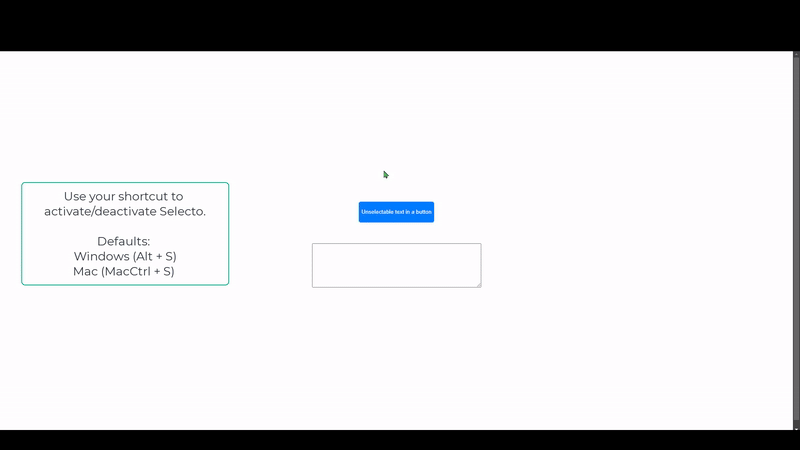

Selecto Chrome Extension- Text Selection for Interactive Elements

Selecto solves a common frustration: selecting text from any elements including interactive elements that normally prevent text selection. With Selecto, you can easily copy text from buttons, dropdowns, links, and other interactive elements that usually block text selection.

Features:
- Select text from any interactive element with a simple keyboard shortcut (defaults: Alt+S, or MacCtrl+S on Mac)
- Works on buttons, dropdowns, links, and other clickable elements
- No more frustration with elements that prevent text selection
- Customizable keyboard shortcuts
- Visual feedback with status indicator
- Optional copy button for selected text
- Clean and simple interface
- Text selections can be used with other plugins such as Google Translate.

Perfect for:
- Translating button texts and menu items
- Copying text from navigation menus
- Extracting text from interactive UI elements
- Web development and testing
